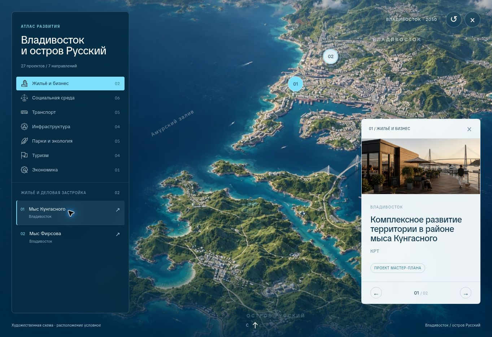

# Проверка опубликованного сайта

Дата: 22 сентября 2026. Проверялась production-версия на GitHub Pages после финальных исправлений.

- Desktop: первый экран, переходы по разделам, карточки территорий и возврат из незаполненного мастер-плана, все три пункта миссии.
- Атлас: семь направлений и количества 2 / 6 / 5 / 4 / 5 / 4 / 1, открытие проекта, следующий и предыдущий проект, сброс, полноэкранный режим и закрытие Escape.
- Адаптивность: отдельный `/qa/` стенд с iframe шириной 320, 390 и 768 пикселей. Проверены мобильное меню, переход к проектам, карточка и следующий проект. На минимальной ширине scrollWidth равен clientWidth; горизонтальной прокрутки нет.
- Исправлены зазор фона при приближении карты, наложение нижней навигации на CTA и кнопки карточки, слипшиеся слова при скрытии переносов строк.
- Названия и порядок всех 27 проектов сопоставлены с листом «ВЫБРАНО» исходной таблицы. Production-сборка и GitHub Pages workflow завершились успешно.

Проверка проведена в Chromium. Отдельная проверка на физических iOS/Android устройствах и в Safari не выполнялась.

