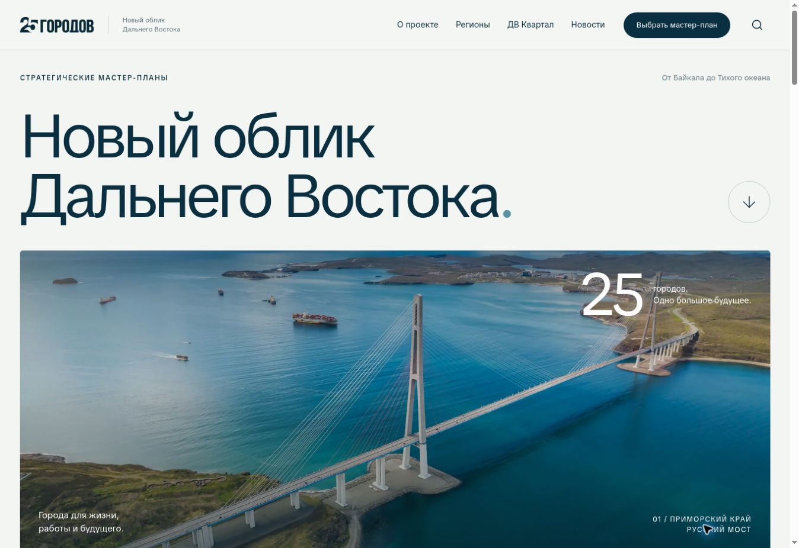
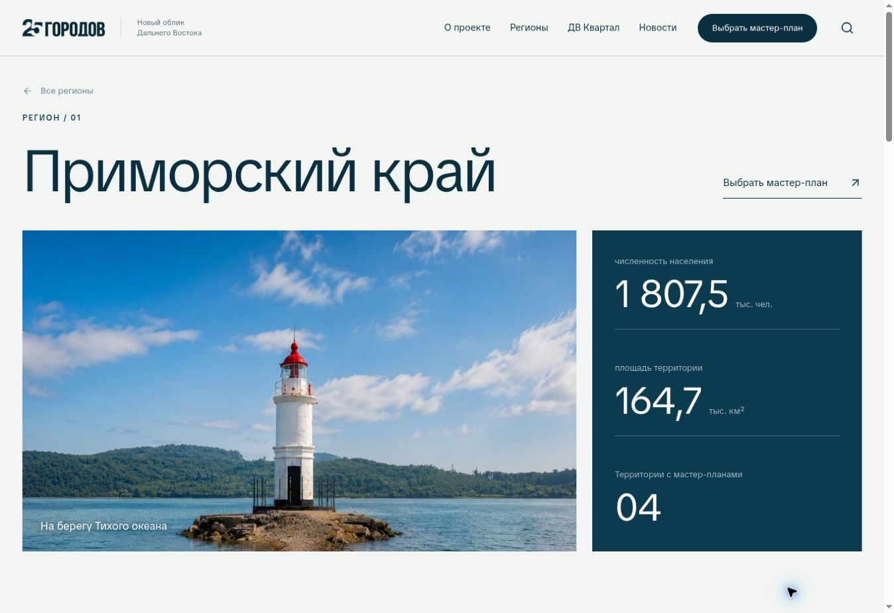

# Editorial Atlas — версия 2

Новая версия в ветке `design/editorial-atlas-v2`. База: `222eefbd0c75e3e034c6357ebb4951d3af15704c`.
Публичный сайт GitHub Pages и ветка `main` сохраняют предыдущую версию.

## Дизайн

- Общая сетка: 12 колонок, межколонник 24 px, единая максимальная ширина 1720 px и внешние поля.
- Новая главная: крупный типографический экран, панорама, выбор города, интерактивный указатель регионов, избранные проекты, городская среда, жильё и новости.
- Каталог регионов: список с фотографией при наведении или фокусе, поиск и отдельный режим городов/агломераций. Поиск учитывает города внутри агломераций.
- Региональные страницы: заголовок, панорама и показатели, прямой переход к мастер-плану территории, программы развития.
- Единые шрифтовые масштабы, формы, карточки и отступы на страницах «О проекте», проектов, новостей, ДВ Квартала и карты.
- Один компонент `UnifiedFooter` для портала и Владивостока. Содержимое городских страниц, промокарты и переключение городов сохранены.
- GSAP ScrollTrigger: мягкое появление секций и небольшой параллакс фотографий. Системная настройка reduced motion отключает анимацию. Прокрутка остаётся нативной.

## Снимки

[Главная целиком](home-full.jpg) · [Главная на телефоне](home-mobile.jpg) · [Регион](region-desktop.jpg)

## Проверено

`npm run build` завершился успешно 24 сентября 2026 года:

- 782 статических маршрута, 40 канонических страниц.
- 507 исходных проектов, 27 утверждённых объектов атласа, 165 новостей, 1093 локальных исходных изображения.
- Проверки 34 региональных/городских шаблонов и исторического Владивостока: 17 исходников, 78 изображений.
- В браузере: главная, регион, каталог территорий, поиск городов, мобильное меню, фильтры проектов, карточка проекта, новостное окно, сравнение ДВ Квартала и карта.
- Проверены представления шириной 320, 390 и 768 px, а также компьютер. Выбор Артёма приводит к Артёму внутри существующей Владивостокской агломерации.
- Сравнение исходников подтверждает: в действующем приложении Владивостока изменено только подключение общего футера. Компоненты городов и данные не редактировались.

Существующее предупреждение о размере пакета данных `isupSnapshot` остаётся; это не ошибка сборки. Для v2 создан отдельный baseline регионов `docs/editorial-v2-regions.json`; baseline версии 1 сохранён.

## Источники приёмов

- [Codrops — Grid Item Reveal Animation on Hover](https://tympanus.net/codrops/2024/03/13/grid-item-reveal-animation-on-hover/) — смена изображения в ответ на выбор пункта.
- [GSAP matchMedia](https://gsap.com/docs/v3/GSAP/gsap.matchMedia()/) — соблюдение системных настроек анимации.
- [GSAP ScrollTrigger](https://gsap.com/docs/v3/Plugins/ScrollTrigger/) — появление секций и параллакс.

Дизайн и компоненты реализованы для проекта; изображения взяты из его существующего набора.
