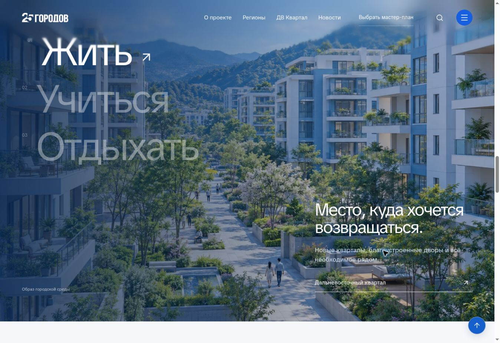

# V3 · Масштаб жизни

Полная пересборка отклонённой версии «Новый горизонт». Ветка: `design/territory-v3`.

## Центральная идея

От большого пространства Дальнего Востока к жизни конкретного человека. Сквозной графический приём — единая фотографическая поверхность, разделённая на пять архитектурных плоскостей. Она раскрывается при прокрутке, реагирует на движение указателя, повторяется в региональных обложках и превращается в геометрию внутренних страниц. Существующая синяя палитра сохранена.

## Новая структура

- Главная начинается пространственной сценой «Дальний. Близкий.». Три панорамы переключаются настоящими кнопками; при прокрутке разрезанная поверхность раскрывается. Нет перехвата колеса или обязательного ожидания анимации.
- Блок масштаба: 11 регионов → 25 городов → 4 млн+ жителей; меняются изображение, объяснение и целевой переход.
- География — интерактивный веер из 11 регионов. Наведение, фокус и нажатие раскрывают выбранный регион. На телефоне используется нативная горизонтальная прокрутка.
- «Жить / Учиться / Отдыхать» — большие сменяемые сцены с отдельными переходами к соответствующим проектам.
- Избранные проекты — горизонтальная лента с привязкой карточек, сенсорной прокруткой и кнопками.
- Новости — редакционные строки. Новости по-прежнему открываются в доступном диалоге.
- Региональные страницы пересобраны: пространственная обложка, полоса показателей, переключаемая сцена мастер-планов и программы с сохранёнными глубокими ссылками.
- Страница «О проекте» построена заново, включая интерактивные этапы «Услышать / Связать / Создать».
- Общая система охватывает проекты, новости, ДВ Квартал, карту и служебные страницы: крупная типографика, плоскости, асимметричные каталоги, новая навигация и подвал.

## Блюр

Семь зон backdrop-filter с градиентными масками, от 24 px до 0.5 px. Цветной или белой подложки нет. Блюр включается только после начала прокрутки. Цвет навигации определяется фактическим блоком под хедером. Для браузеров без backdrop-filter предусмотрена читаемая подложка соответствующего тона.

## Референсы

| Референс | Использованный приём |
| --- | --- |
| [Likova](https://likova.space/) | Архитектурная композиция, крупный текст, ступенчатые маски, раскрытие панорамы |
| [DeGirum](https://degirum.videinfra.com/) | Один графический объект связывает состояния; интерфейс объясняет через взаимодействие |
| [Food Compliance International](https://foodcomplianceinternational.com/) | Повторяемая диагональная геометрия, контраст фотографий и фирменного цвета |
| [Discovermarket](https://discovermarket.videinfra.com/) | Пространственные слои и последовательное движение от общего к конкретному |

Likova, DeGirum и Discovermarket повторно просмотрены в браузере. Food Compliance заблокировал облачный браузер; для него использован ранее полученный визуальный материал.

## Сохранённые ограничения

Компоненты, данные и стили городов и агломераций не изменялись. Все новые правила ограничены `.v3-site`; городские страницы получают `.ed-preserve-city`. Исторические V1/V2 эталоны сохранены; обновлён только отдельный V3 baseline регионов.

Поддерживаются клавиатура, фокус, reduced motion, сенсорная прокрутка. Скрытая часть вступительной анимации не доступна фокусу. Поиск, фильтры, модальные новости, сравнение кварталов и ссылки на мастер-планы сохранены.

## Проверка

- `npm run build`: 782 маршрута, 40 канонических страниц, 507 проектов, 165 статей, 1093 локальных медиафайла.
- Проверки исторического Владивостока (17 исходников, 78 ресурсов), согласованных объектов и 34 региональных/городских макетов пройдены.
- Браузер: главная и тёмный блок, переключение панорам и масштаба; региональный поиск; веер; выбор территории; фильтр «школ» (33 результата); вид списком; новостной диалог; сравнение кварталов; этапы мастер-плана; меню.
- Просмотр desktop, телефонов 320 и 390 px. Исправлены наследуемая сетка веера, перенос метрики «4 млн+», контраст показателей кварталов и момент включения блюра.
- `git diff --check` пройден.

Исходники сохраняются в отдельной ветке; для просмотра обновляется существующая приватная сборка Sites. Публикации V1/V2 и общий workflow GitHub Pages не изменены.

