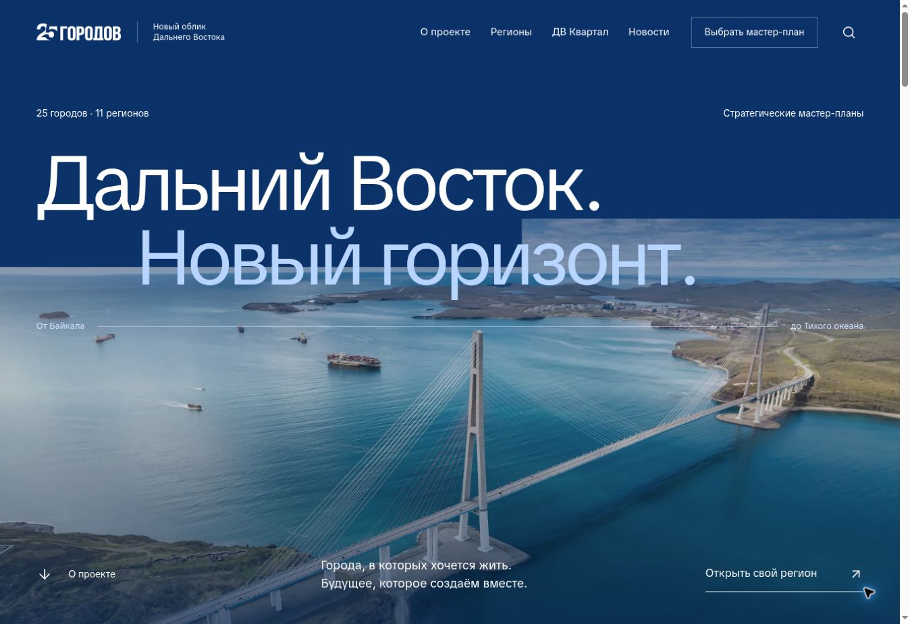
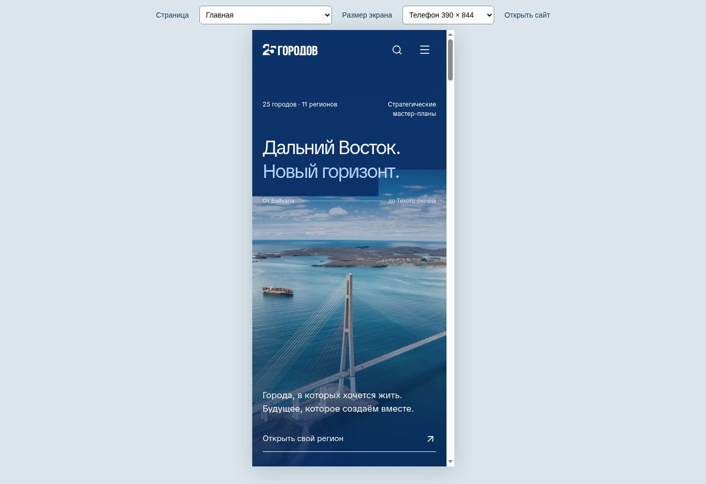

# V3 · Новый горизонт

Дизайн-концепция для портала «25 городов». Ветка: `design/territory-v3`.

## Центральная идея

Горизонт объединяет Дальний Восток и его будущее: широкие панорамы, горизонтальные линии, открытые композиции и крупная типографика. Сохраняется существующая синяя палитра. Главная рассказывает последовательную историю: масштаб → география → проекты → жизнь → события.

## Что изменилось

- Новая главная: панорамный первый экран, список регионов с переключением изображения, крупный проект, сценарии «Жить / Учиться / Отдыхать», новости.
- Единая композиция внутренних страниц: каталог регионов, страницы регионов, проекты, ДВ Квартал, новости, информация о проекте, карта и служебные страницы.
- Хедер с progressive backdrop blur: шесть слоёв размытия с градиентными масками. Размытие сильнее сверху и плавно исчезает к нижнему краю. Контраст логотипа и навигации меняется при прокрутке.
- Общий подвал, единые отступы и типографический масштаб; мягкие анимации с поддержкой `prefers-reduced-motion`.
- Поиск города в каталоге учитывает города внутри агломераций.

Страницы городов и агломераций сохраняют прежние компоненты, стили и данные. Новые правила ограничены `.v3-site`; городские страницы получают `.ed-preserve-city`. Исходные V1/V2 эталоны проверок сохранены, для V3 добавлен отдельный `docs/horizon-v3-regions.json`.

## Приёмы референсов

| Референс | Применение в V3 |
| --- | --- |
| [Likova](https://likova.space/) | Архитектурная панорама, большой масштаб текста, ступенчатая граница первого экрана |
| [DeGirum](https://degirum.videinfra.com/) | Сквозной графический мотив и плавное появление крупных элементов |
| [Food Compliance International](https://foodcomplianceinternational.com/) | Повторяемая фирменная геометрия и собранная навигация |
| [Discovermarket](https://discovermarket.videinfra.com/) | Последовательное объяснение через крупные содержательные секции |

## Проверено 28 сентября 2026

- `npm run build`: успешно; 782 статических маршрута, 40 канонических страниц, 507 проектов, 165 полных статей, 1093 локальных медиафайла.
- Встроенные проверки защищённых страниц Владивостока и всех 34 региональных/городских макетов: успешно.
- `git diff --check`: успешно.
- В браузере: первый экран и прокрутка на desktop, мобильные размеры 320 и 390, планшет 768; меню и закрытие Escape; смена проекта; сценарий «Учиться»; поиск «Артём» в каталоге; фильтр проектов «школ»; окно проекта; новостное окно; отрисовка карты.
- Визуальная проверка: главная, каталог регионов, Приморье, проекты, ДВ Квартал, о проекте и карта. Исправлены контраст хедера, светлые заголовки на светлом фоне и масштаб длинного заголовка квартала.

## Просмотр

Исходники V3 сохраняются в отдельной ветке. Общий процесс GitHub Pages не изменён. Для проверки подготовлена отдельная приватная сборка Sites, без замены существующих V1 и V2.

